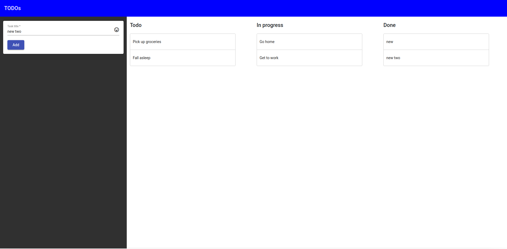

# App

### Tech stack used
 - Angular
 - Angular material
 - Bootstrap
 - Angular material cdk

### How to run
1. Git clone the project.
2. Run `npm install` to install the libraries.
3. Run `npm server` to start the project.